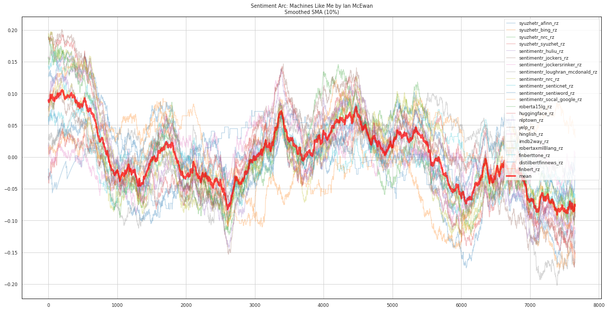
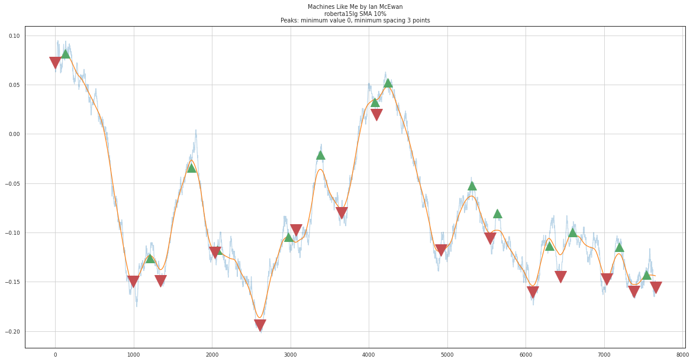
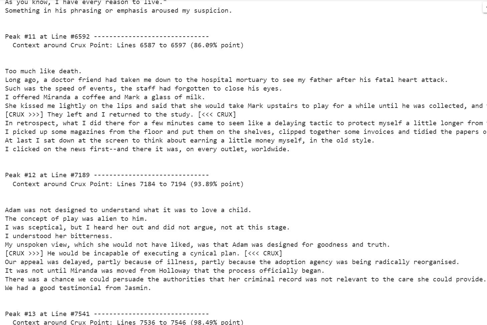
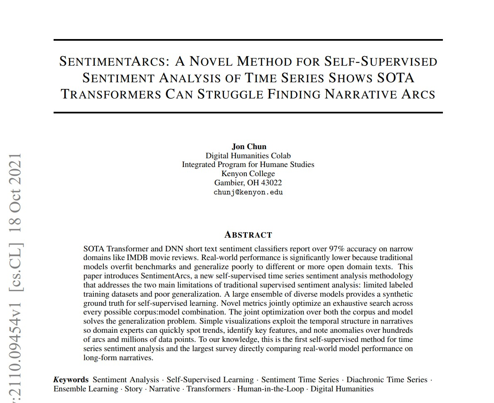
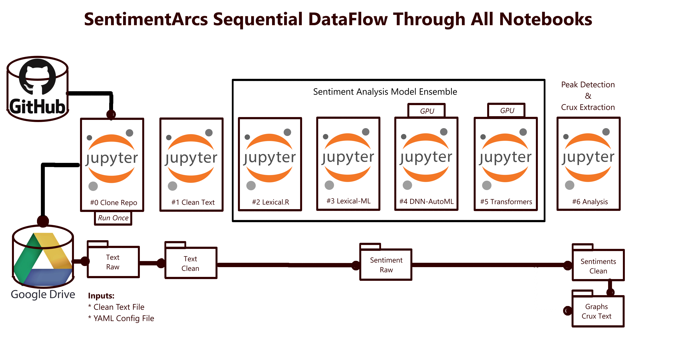

<!--
*** Thanks for checking out the Best-README-Template. If you have a suggestion
*** that would make this better, please fork the repo and create a pull request
*** or simply open an issue with the tag "enhancement".
*** Don't forget to give the project a star!
*** Thanks again! Now go create something AMAZING! :D

*** Jon Chun 20 Apr 2022 Update

*** REFERENCE: https://github.com/othneildrew/Best-README-Template/blob/master/README.md
-->

<!-- PROJECT SHIELDS -->
<!--
*** I'm using markdown "reference style" links for readability.
*** Reference links are enclosed in brackets [ ] instead of parentheses ( ).
*** See the bottom of this document for the declaration of the reference variables
*** for contributors-url, forks-url, etc. This is an optional, concise syntax you may use.
*** https://www.markdownguide.org/basic-syntax/#reference-style-links
-->

<!---
[![Contributors][contributors-shield]][contributors-url]
[![Forks][forks-shield]][forks-url]
[![Stargazers][stars-shield]][stars-url]
[![Issues][issues-shield]][issues-url]
[![MIT License][license-shield]][license-url]
[![LinkedIn][linkedin-shield]][linkedin-url]
--->

<!-- PROJECT LOGO -->
 

    
  <h3 align="center">SentimentArcs - Emotion in Text</h3>

  

    An end-to-end pipeline based on Jupyter notebooks to detect, extract, process and anlayze emotion over time in text.
     
    <a href="https://github.com/othneildrew/Best-README-Template"><strong>Explore the docs »</strong></a>
     
     
    <a href="https://github.com/othneildrew/Best-README-Template">Quick Video Overview</a>
    ·
    <a href="https://www.cambridge.org/core/what-we-publish/elements/cambridge-elements-series">Cambridge University Press Elements by Katherine Elkins</a>
    ·
    <a href="https://github.com/jon-chun/sentiment_arcs/issues">Report a Bug or Request a Feature</a>
    ·
    More Research by <a href="https://arxiv.org/abs/2110.09454">Jon Chun</a> and <a href="https://kenyon.academia.edu/KatherineElkins">Katherine Elkins</a>
    ·
    <a href="https://github.com/jon-chun/sentiment_arcs/affectiveai_links">References on Sentiment Analysis, AffectiveAI and Related Topics</a>
  

<!-- TABLE OF CONTENTS -->

<b>Table of Contents</b>
<ol>
  <li>
    <a href="#welcome">Welcome</a>
  </li>
  <li>
    <a href="#background">Background</a>
  </li>
    <li>
    <a href="#features">Features</a>
  </li>
  <li>
    <a href="#models">Sentiment Analysis Models</a>
  </li>
  <li>
    <a href="#notebooks">Notebooks and Dataflow</a>
  </li>
  <li>
    <a href="#corpora">Reference Corpora</a>
  </li>
  <li>
    <a href="#installation">Installation</a>
  </li>
  <li>
    <a href="#examples">Examples</a>
  </li>
  <li>
    <a href="#license">License</a>
  </li>
  <li>
    <a href="#contact">Contact and Contribute</a>
  </li>
</ol>

     
    <!--- width="2048" height="1018"> --->
  <b>Fig 1:</b> SentimentArcs Ensembles over three dozen Sentiment Analysis Models from simple XAI Lexicons to State-of-the-Art Transformers (including Models specialized for Financial and Social Texts)
   
   
     
    <!---  width="2048" height="1018"> --->
  <b>Fig 2:</b> Efficient Exploratory Data Analysis (EDA) by Domain Expert to customize Models, Hyperparameters and Time Series Processing
   
   
    <kbd>
     
    </kbd>
    <!---  width="2048" height="1018"> --->
  <b>Fig 3:</b> Automatic Peak/Valley detection and Text Extraction around Crux Points
   
   

 

<h2>Welcome!</h2>

SentimentArcs is a novel methodology and software framework for analyzing emotion in long texts or sequenced collections of shorter texts using Diachronic Sentiment Analysis. It segments any corpus of long text into semantic units (e.g. sentences, tweets, financial posts), applying an ensemble of over three dozen NLP sentiment analysis models from simple lexical models to state-of-the-art Transformer models. The resulting sentiment time series can be smoothed so key features like peaks and valleys can be detected and the surrounding text around these key crux points can be extracted for analysis by domain experts.

For literary experts features like peaks and valleys often correspond to key crux points in a narrative. For a financial analyst, these could represent regime changes or arbitrage opportunities. For a social media analysts, these swings in could represent shifting public opinion on key topics, public figures or even terrorist cell activities. SentimentArcs is built around a large ensemble of sentiment analysis models that surface interesting emotional arcs that domain experts can use to efficiently detect subtle and complex ground truths hidden within any sequenced body of text. 

(<a href="#top">back to top</a>)

<h2>Background</h2>

SentimentArcs is the result of many years of our experiences researching a wide variety of AI and machine learning techniques to assist human experts in the extremely challenging task of analyzing and generating natural language texts. This includes a focus on AffectiveAI approaches to analyzing diverse textual corpora including literature, social media, news, scripts, lyrics, speeches, poems, financial reports, legal documents, etc. Virtually all sequential long-form texts have detectable and measurable sentiment changes over time that reveal cohesive narrative elements. SentimentArcs helps domain experts efficiently arbitrate between competing machine learning and AI NLP models to quickly and efficiently identify, analyze and discover latent narratives elements and emotional arcs in text. 

SentimentArcs is the novel software framework underlying  <a href="https://www.cambridge.org/core/what-we-publish/elements/cambridge-elements-series">Katherine Elkins upcoming Cambridge Elements book </a>. This text speaks to the domain expert in Narrative Studies, Comparative Literature and English who want to learn how to use NLP sentiment analysis in general, and SentimentArcs in particular, for analyzing literature. The approach in this Cambridge Elements text is entirely generalizable to other fields. A more technical introduction to the core framework of SentimentArcs can be found in the <a href="https://arxiv.org/abs/2110.09454">October 2021 ArXiv paper by Jon Chun</a>. The Abstract of this paper outlines the technical focus and practical goals of SentimentArcs:

<blockquote>
SOTA Transformer and DNN short text sentiment classifiers report over 97% accuracy on narrow domains like IMDB movie reviews. Real-world performance is significantly lower because traditional models overfit benchmarks and generalize poorly to different or more open domain texts. This paper introduces SentimentArcs, a new self-supervised time series sentiment analysis methodology that addresses the two main limitations of traditional supervised sentiment analysis: limited labeled training datasets and poor generalization. A large ensemble of diverse models provides a synthetic ground truth for self-supervised learning. Novel metrics jointly optimize an exhaustive search across every possible corpus:model combination. The joint optimization over both the corpus and model solves the generalization problem. Simple visualizations exploit the temporal structure in narratives so domain experts can quickly spot trends, identify key features, and note anomalies over hundreds of arcs and millions of data points. To our knowledge, this is the first self-supervised method for time series sentiment analysis and the largest survey directly comparing real-world model performance on long-form narratives.
</blockquote>

(<a href="#top">back to top</a>)

<h2>Features</h2>

* The largest ensemble of open NLP sentiment analysis models that we know of (currently over 3 dozen)
* Efficient and Flexible Human-in-the-Loop to supervise, customize, tune the entire end-to-end process of sentiment analysis
* Flexible statistical, visualization and text customizations so Domain Experts can easily identify, extract and analyze key features and surrounding text from sentiment time series.
* Access to domain-specific baselines (Novels, Finance and Social Media) based upon carefully curated corpora
* Novel Time Series Synthesis and Data Augmentation for NLP Sentiment Analysis Time Series
* Novel Peak Detection Algorithms customized for NLP Sentiment Analysis Time Series
* Easy access via free Google Colab Jupyter notebooks with access to powerful GPU accelerators
* Minimal setup, training and support costs

(<a href="#top">back to top</a>)

<h2>Sentiment Analysis Models</h2>

* Text preprocessing (cleaning, advanced sentence segmentation, custom stopword sets, etc)
* An ensemble of over 3 dozen Sentiment Analysis Models including a diverse representation of major families (including the most popular sentiment analysis libraries and models from both R and Python as well as some AutoML techniques):

<blockquote>
<ul>
<li> Lexical
<li> Heuristics
<li> Linguistic
<li> GOFAI Machine Learning
<li> Deep Neural Networks & AutoML
<li> State of the Art Transformer Models
</ul>
</blockquote>

(<a href="#top">back to top</a>)

<h2>Notebooks and Dataflow</h2>

Concretely, SentimentArcs consists of a series of software modules embodied as Jupyter notebooks and supporting libraries designed to work on Google's free Colab service. Notebooks are executed in sequence reflecting different steps in the pipeline from text cleaning to sentiment time series analysis. Despite some shortcomings, Google Colab offers the lowest technical barrier for the widest range of non-technical domain experts as well as powerful-GPU backed Jupyter notebooks required for the most powerful state-of-the-art models in our ensemble. SentimentArc models/notebooks include:

SentimentArcs is best viewed as an ordered pipeline of Google Colab Jupyter Notebooks that are run in sequence as follows:

<ol>
<li>Notebook 0: Copy SentimentArcs Github repo to your Google GDrive (run once at setup or to reset)
<li>Notebook 1: Preprocessing Text
<li>Notebook 2: Sentiment Analysis Models: R Lexicon and Heuristic using SyuzhetR(4) and SentimentR(8)
<li>Notebook 3: Sentiment Analysis Models: Python Lexicon, Heuristic and ML 
<li>Notebook 4: Sentiment Analysis Models: DNN and AutoML
<li>Notebook 5: Sentiment Analysis Models: Transformers(11)
<li>Notebook 6: Analysis, Visualizations, Smoothing and Crux Extraction
</ol>

Data flows through the project subdirectory structure in a corresponding manner:

<ol>
<li>text_raw: minimally prepared textfiles for the corpus
<li>text_clean: text further cleaned by SentimentArcs
<li>sentiment_raw: raw sentiment values for all texts in the corpus
<li>sentiment_clean: processed sentiment time series 
<li>graphs_cruxes: extracted key features/crux points with surrounding text
</ol>

(<a href="#top">back to top</a>)

<h2>Reference Corpora</h2>

SentimentArcs can be viewed as an end-to-end pipeline to detect, extract, preprocess and analyze sentiment in any corpus of long-form texts. This includes both individual long-form texts as well as corpora compiled from individually time-sequenced smaller texts like compilations of specific authors, genres, or periods as well as tweets, financial reports, topical news articles, speeches, etc. Initially, SentimentArcs is focused on offering users both carefully curated reference corpora to provide a ground truth and a baseline reference for specific genres of text including novels, financial texts and social media. SentimentArcs also enables users to create new corpora of customized texts for specialized sentiment analysis tasks and analysis. Currently, SentimentArcs provides reference corpora for these types of texts (with more to be added in the future):

* Novels
* Financial Texts
* Social Media

For example, the reference corpus for novels consists of 25 narratives selected to create a diverse set of well-recognized novels that can serve as a benchmark for sentiment analysis of other texts. The novel corpora spans approximately 2300 years from Homer’s Odyssey to the 2019 Machines like Me by award-winning author Ian McEwan. Early 20th century modernists are emphasized by authors like Marcel Proust and Virginia Woolf. In sum, the corpora include (1) the two most popular novels on Gutenberg.org (Project Gutenberg, 2021b), (2) eight of the fifteen most assigned novels at top US universities (EAB, 2021), and (3) three works that have sold over 20 million copies (Books, 2021). There are eight works by women, two by African-Americans and five works by two LGBTQ authors. Britain leads with 15 authors followed by 6 Americans and one each from France, Russia, North Africa and Ancient Greece.

(<a href="#top">back to top</a>)

<h2>Installation</h2>

SentimentArcs relies upon Google to provide easy-to-use, ubiquitous and free access to powerful GPU-backed Jupyter Notebooks. Here are the free resources you should sign-up to use SentimentArcs:

* Google GMail Account (to have access to GDrive)
* Activate  to your GDrive from the Google Workspace Market
* Github account (to report issues or comment)

Colab Jupyter Notebooks offer several significant advantages including easy access via an intuitive web browser, low/no support costs and a powerful GPU backend VM for free.  However, it comes with some limitations to be aware of including required sequential execution, latencies and limited interface design. 

To set up SentimentArcs, please follow the instructions below carefully as each step depends upon the previous steps.

<ol>
<li>Login to Google, go to your GDrive and create a subfolder to hold your copy of the SentimentArc project (e.g. /MyDrive/sentimentarcs_notebooks/)
<li>Be sure you have connected the Colab Notebooks app from the Google Workplace Market.
<li>Navigate to your SentimentArcs project subdirectory and create/open a new Colab Notebook.
<li>On the new blank Colab Notebook, to the top left corner and select [File]->[Open Notebook]. When a pop-up window appears, select the [Github] from the right side of the top horizontal menu. Enter 'https://github.com/jon-chun/sentimentarcs_notebooks' on the top line after the prompt [Enter a GitHub URL or search by organization or user], click the search icon, and select 'sentiment_arcs_part1_text_preprocessing.ipynb' from the list below.
<li>Run the first code cell to 'Connect Google GDrive' and grant permission for this notebook to connect to your GDrive.
<li>Edit the input on the second code cell to point to the SentimentArcs project directory you defined in Step 1 and other information asked. Be sure to execute this code cell after entering this information.
<li>Executing the next cell should copy over the current SentimentArcs code from Github if it does not already exist in your GDrive.
</ol>

(<a href="#top">back to top</a>)

<h2>Examples</h2>

At DHColab we use Sentiment Analysis to analyze and extract features from all kinds of texts including: novels, social media, news, filings financial filings, lyrics, speeches, research papers, lyrics, poems, etc. SentimentArcs is a formalization of many of the best practices we developed over the years.  Each type of text (e.g. Novels, Social Media, News, Financial Texts, etc) shares common analysis techniques as well as requires customized methodologies tailored to each genre. For example, for novels we are seeking to surface latent features of narrative like plot, financial texts often reveal shifts in investor sentiment, and peaks/valleys in social media sentiment can reflect shifts in public opinion on current events, political candidates or new products/services.

In addition to Dr. Elkins' Cambridge Elements text referenced above, here are several examples from our DHColab that demonstrate the use of sentiment analysis to analyze various types of text.

<b>Novels:</b>

<ol>
    <li><a href="https://digital.kenyon.edu/dh_iphs_ss/1/">Adapted Arcs: Sentiment Analysis and The Sorcerer's Stone</a> by Erin Shaheen</li>
    <li><a href="https://digital.kenyon.edu/dh_iphs_ai/12/">Doubles and Reflections: Sentiment Analysis and Vladimir Nabokov’s Pale Fire</a> by Catherine Perloff</li>
</ol>

<b>Financial Texts:</b>

<ol>
    <li><a href="https://digital.kenyon.edu/dh_iphs_ai/8/">Computational Approaches to Predicting Cryptocurrency Prices</a> by Chris Pelletier</li>
</ol>

<b>Social Media:</b>

<ol>
    <li><a href="https://digital.kenyon.edu/dh_iphs_ss/7/">Analyzing Covid-19 Through a Sentiment Analysis of Twitter Data</a> by Cameron Catana</li>
</ol>

<h2>License</h2>

<a href="https://github.com/jon-chun/sentimentarcs_notebooks/blob/main/LICENSE">MIT License</a>

<h2>Contact and Contribute</h2>

SentimentArcs arose from a multi-year collaboration between academia and industry and across disciplines including comparative literature, econometrics, social sciences, data analytics and ML/AI among others. The world is too interconnected, the interesting problems are too challenging and the solutions are both too complex as well as interdisciplinary in nature for any one domain expert.

As a result, we welcome collaboration and contributions that can help grow SentimentArcs into the premier NLP tool for sentiment analysis which includes experts from both technical and non-technical domains. Here are just a few ways you could contribute to SentimentArcs, the broader Digital Humanities, and NLP community:

<ol>
<li>Use SentimentArcs to analyze existing reference corpora to identify strengths/limitations of various models, optimal hyperparameters, interpretations, etc
<li>Contribute new texts (e.g. novels, financial reports, social media compilations)
<li>Compile, expand upon the reference corpora for Finance, Social Media, or other text genres
<li>Suggest or contribute code to add new sentiment analysis models 
<li>Help with documentation, training and interpretation
<li>Bug identification/fixes
<li>Suggestions or code for new features and improved performance
</ol>

(<a href="#top">back to top</a>)

