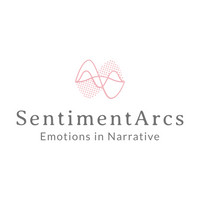
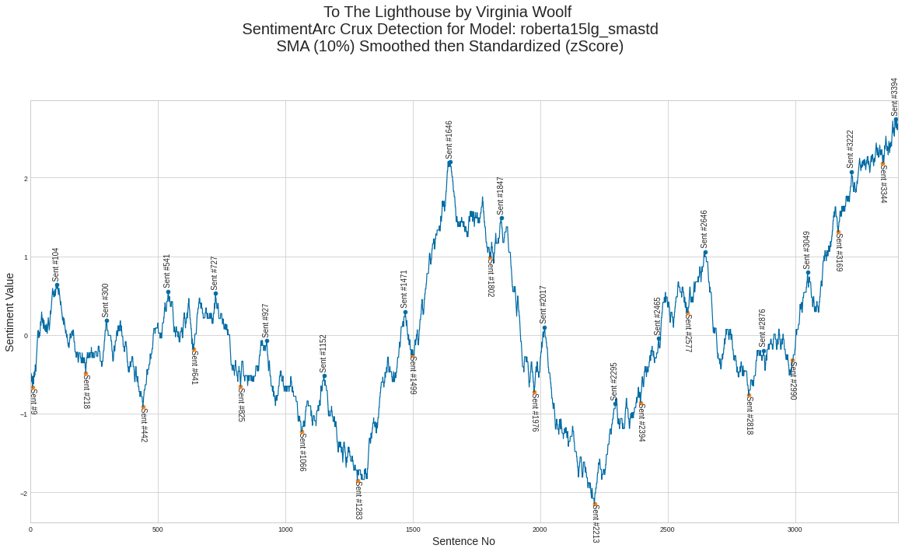
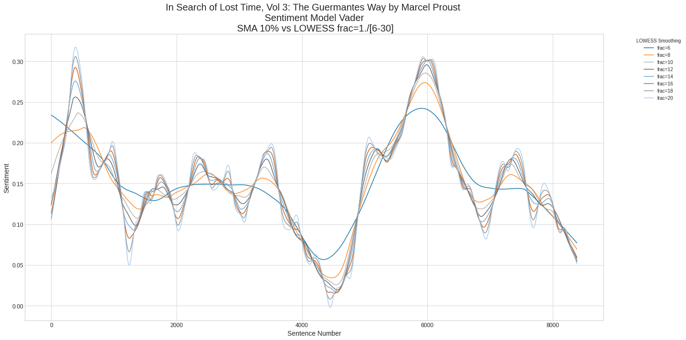

<div id="top"></div>
<!--
*** Thanks for checking out the Best-README-Template. If you have a suggestion
*** that would make this better, please fork the repo and create a pull request
*** or simply open an issue with the tag "enhancement".
*** Don't forget to give the project a star!
*** Thanks again! Now go create something AMAZING! :D

*** Jon Chun 24 Mar 2022 Update

*** REFERENCE: https://github.com/othneildrew/Best-README-Template/blob/master/README.md
-->


<!-- PROJECT SHIELDS -->
<!--
*** I'm using markdown "reference style" links for readability.
*** Reference links are enclosed in brackets [ ] instead of parentheses ( ).
*** See the bottom of this document for the declaration of the reference variables
*** for contributors-url, forks-url, etc. This is an optional, concise syntax you may use.
*** https://www.markdownguide.org/basic-syntax/#reference-style-links
-->

<!---
[![Contributors][contributors-shield]][contributors-url]
[![Forks][forks-shield]][forks-url]
[![Stargazers][stars-shield]][stars-url]
[![Issues][issues-shield]][issues-url]
[![MIT License][license-shield]][license-url]
[![LinkedIn][linkedin-shield]][linkedin-url]
--->


<!-- PROJECT LOGO -->
<br />
<div align="center">
  <a href="https://github.com/jon-chun/sentiment_arcs">
    
  </a>

  <h3 align="center">Sentiment Arcs - Emotion in Texts</h3>

  <p align="center">
    An end-to-end pipeline to detect, extract, process and anlayze sentiment analysis time series in long text(s).
    <br />
    <a href="https://github.com/othneildrew/Best-README-Template"><strong>Explore the docs »</strong></a>
    <br />
    <br />
    <a href="https://github.com/othneildrew/Best-README-Template">Quick Video Overview</a>
    ·
    <a href="https://www.cambridge.org/core/what-we-publish/elements/cambridge-elements-series">University of Cambridge Press Elements Textbook by Katherine Elkins</a>
    ·
    <a href="https://github.com/jon-chun/sentiment_arcs/issues">Report a Bug or Request a Feature</a>
    ·
    More Research by <a href="https://arxiv.org/abs/2110.09454">Jon Chun</a> and <a href="https://kenyon.academia.edu/KatherineElkins">Katherine Elkins</a>
    ·
    <a href="https://github.com/jon-chun/sentiment_arcs/affectiveai_links">References on Sentiment Analysis, AffectiveAI and Related Topics</a>
  </p>
</div>


<!-- TABLE OF CONTENTS -->
<details>
  <summary>Table of Contents</summary>
  <ol>
    <li>
      <a href="#about-the-project">About The Project</a>
      <ul>
        <li><a href="#built-with">Built With</a></li>
      </ul>
    </li>
    <li>
      <a href="#getting-started">Getting Started</a>
      <ul>
        <li><a href="#prerequisites">Prerequisites</a></li>
        <li><a href="#installation">Installation</a></li>
      </ul>
    </li>
    <li><a href="#usage">Usage</a></li>
    <li><a href="#roadmap">Roadmap</a></li>
    <li><a href="#contributing">Contributing</a></li>
    <li><a href="#license">License</a></li>
    <li><a href="#contact">Contact</a></li>
    <li><a href="#acknowledgments">Acknowledgments</a></li>
  </ol>
</details>


<!-- ABOUT THE PROJECT -->

<!---
## About The Project

[![Product Name Screen Shot][product-screenshot]](https://example.com)
--->

<div align="center">
  <a href="https://github.com/jon-chun/sentiment_arcs">
     
    <!--- width="2048" height="1018"> --->
  </a>
  <br>
  <a href="https://github.com/jon-chun/sentiment_arcs">
     
    <!---  width="2048" height="1018"> --->
  </a>
  <br>
  <a href="https://github.com/jon-chun/sentiment_arcs">
     
    <!---  width="2048" height="1018"> --->
  </a>
  <br>
</div> 

<b>Welcome!</b>

SentimentArcs is a novel methodology and software framework for analyzing emotion in long texts or sequenced collections of shorter texts using Diachronic Sentiment Analysis. It works by segmenting any corpus of long text into semantic units (e.g. sentences, tweets, financial outlooks), applying an ensemble of over three dozen NLP sentiment analysis models, performing time series analysis and extracting peaks, valleys and other key features reflecting interesting ground truth realities for domain experts. For literary experts these often correspond to key crux point in narrative. For financial analyst these could represent regime changes or arbitrage opportunities. For social media analysts these swings in could represent shifting public opinion on key topics, public figures or even terrorist cell activities.

SentimentArcs is the result of many years of our experiences pplying a wide variety of AI and machine learning technique to assist human experts in the extremely challenging task of analyzing and generating natural language texts. This includes a focus on AffectiveAI approaches to analyzing diverse textual corpora including literature, social media, news, scripts, lyrics, speeches, poems, financial reports, legal documents, etc. Virtually all long text contains narrative elements and Sentiment Arcs tries to uncover latent correlations to these with measurable sentiment changes over the course of time. 

SentimentArcs is the novel software framework underlying  <a href="https://www.cambridge.org/core/what-we-publish/elements/cambridge-elements-series">Katherine Elkins upcoming University of Cambridge Elements text </a>. This text speaks to the domain expert who wants to learn how to use sentiment analysis in general, and Sentiment Arcs in particular, for analyzing literature. The approach in this Cambridge Elements text is entirely generalizable to other fields. A more technical introduction to the core framework of Sentiment Arcs can be found in the <a href="https://arxiv.org/abs/2110.09454">October 2021 ArXiv paper by Jon Chun</a>. The Abstract of this paper outlines the technical focus and practical goals of Sentiment Arcs:

<blockquote>
SOTA Transformer and DNN short text sentiment classifiers report over 97% accuracy on narrow domains like IMDB movie reviews. Real-world performance is significantly lower because traditional models overfit benchmarks and generalize poorly to different or more open domain texts. This paper introduces SentimentArcs, a new self-supervised time series sentiment analysis methodology that addresses the two main limitations of traditional supervised sentiment analysis: limited labeled training datasets and poor generalization. A large ensemble of diverse models provides a synthetic ground truth for self-supervised learning. Novel metrics jointly optimize an exhaustive search across every possible corpus:model combination. The joint optimization over both the corpus and model solves the generalization problem. Simple visualizations exploit the temporal structure in narratives so domain experts can quickly spot trends, identify key features, and note anomalies over hundreds of arcs and millions of data points. To our knowledge, this is the first self-supervised method for time series sentiment analysis and the largest survey directly comparing real-world model performance on long-form narratives.
</blockquote>

From another perspective, SentimentArcs can be viewed as an end-to-end pipeline to detect, extract, preprocess and analyze sentiment in any corpus of long-form texts. This includes both individual long-form texts as well as corpora compiled from individually time sequenced smaller texts like compilations of specific authors, genres, or periods as well as tweets, financial reports, topical news articles, speeches, etc. Initally, Sentiment Arcs is focused on offering users both carefully curated reference corpora to provide a grounding and baseline reference, as well as the ability to add custom compiled copora in these three areas:

* Novels
* Financial Texts
* Social Media

Concretely, Sentiment Arcs consists of a series of software modules embodied as Jupyter notebooks and supporting libraries designed to work on Google's free Colab service. Notebooks are executed in sequence reflecting different steps in the pipeline from text cleaning to sentiment time series analysis. Despite some shortcomings, Google Colab offers the lowest technical barrier for the widest range of non-technical Domain Experts as well as powerful-GPU backed Jupyter notebooks required for the most powerful state-of-the-art models in our ensemble. SentimentArc models/notebooks include:

* Text preprocessing (cleaning, advanced sentence segmentation, custom stopword sets, etc)
* An ensemble of over 3 dozen Sentiment Analysis Model including a diverse representation of major families (including the most popular sentiment analysis libraries and models from both R and Python as well as some AutoML techniques):

<blockquote>
<ul>
<li> Lexical
<li> Heuristics
<li> GOFAI Machine Learning
<li> Deep Neural Networks
<li> State of the Art Transformer Models
</ul>
</blockquote>

* Novel Time Series Synthesis and Data Augmentation for NLP Sentiment Analysis Time Series
* Novel Peak Detection Algorithms customized for NLP Sentiment Analysis Time Series
* Efficient and Flexible Human-in-the-Loop to customize and tune the entire end-to-end process
* Flexible statistical, visualzation and text cutomizations so Domain Experts can quickly identify, extract and analyze key features of time series.


<p align="right">(<a href="#top">back to top</a>)</p>


<!---
### Built With

This section should list any major frameworks/libraries used to bootstrap your project. Leave any add-ons/plugins for the acknowledgements section. Here are a few examples.

* [Next.js](https://nextjs.org/)
* [React.js](https://reactjs.org/)
* [Vue.js](https://vuejs.org/)
* [Angular](https://angular.io/)
* [Svelte](https://svelte.dev/)
* [Laravel](https://laravel.com)
* [Bootstrap](https://getbootstrap.com)
* [JQuery](https://jquery.com)

<p align="right">(<a href="#top">back to top</a>)</p>
--->


<!-- GETTING STARTED -->
## Getting Started

This is an example of how you may give instructions on setting up your project locally.
To get a local copy up and running follow these simple example steps.

### Prerequisites

This is an example of how to list things you need to use the software and how to install them.
* npm
  ```sh
  npm install npm@latest -g
  ```

### Installation

_Below is an example of how you can instruct your audience on installing and setting up your app. This template doesn't rely on any external dependencies or services._

1. Get a free API Key at [https://example.com](https://example.com)
2. Clone the repo
   ```sh
   git clone https://github.com/your_username_/Project-Name.git
   ```
3. Install NPM packages
   ```sh
   npm install
   ```
4. Enter your API in `config.js`
   ```js
   const API_KEY = 'ENTER YOUR API';
   ```

<p align="right">(<a href="#top">back to top</a>)</p>


<!-- USAGE EXAMPLES -->
## Usage

Use this space to show useful examples of how a project can be used. Additional screenshots, code examples and demos work well in this space. You may also link to more resources.

_For more examples, please refer to the [Documentation](https://example.com)_

<p align="right">(<a href="#top">back to top</a>)</p>


<!-- ROADMAP -->
## Roadmap

- [x] Add Changelog
- [x] Add back to top links
- [ ] Add Additional Templates w/ Examples
- [ ] Add "components" document to easily copy & paste sections of the readme
- [ ] Multi-language Support
    - [ ] Chinese
    - [ ] Spanish

See the [open issues](https://github.com/othneildrew/Best-README-Template/issues) for a full list of proposed features (and known issues).

<p align="right">(<a href="#top">back to top</a>)</p>


<!-- CONTRIBUTING -->
## Contributing

Contributions are what make the open source community such an amazing place to learn, inspire, and create. Any contributions you make are **greatly appreciated**.

If you have a suggestion that would make this better, please fork the repo and create a pull request. You can also simply open an issue with the tag "enhancement".
Don't forget to give the project a star! Thanks again!

1. Fork the Project
2. Create your Feature Branch (`git checkout -b feature/AmazingFeature`)
3. Commit your Changes (`git commit -m 'Add some AmazingFeature'`)
4. Push to the Branch (`git push origin feature/AmazingFeature`)
5. Open a Pull Request

<p align="right">(<a href="#top">back to top</a>)</p>


<!-- LICENSE -->
## License

Distributed under the MIT License. See `LICENSE.txt` for more information.

<p align="right">(<a href="#top">back to top</a>)</p>


<!-- CONTACT -->
## Contact

Your Name - [@your_twitter](https://twitter.com/your_username) - email@example.com

Project Link: [https://github.com/your_username/repo_name](https://github.com/your_username/repo_name)

<p align="right">(<a href="#top">back to top</a>)</p>


<!-- ACKNOWLEDGMENTS -->
## Acknowledgments

Use this space to list resources you find helpful and would like to give credit to. I've included a few of my favorites to kick things off!

* [Choose an Open Source License](https://choosealicense.com)
* [GitHub Emoji Cheat Sheet](https://www.webpagefx.com/tools/emoji-cheat-sheet)
* [Malven's Flexbox Cheatsheet](https://flexbox.malven.co/)
* [Malven's Grid Cheatsheet](https://grid.malven.co/)
* [Img Shields](https://shields.io)
* [GitHub Pages](https://pages.github.com)
* [Font Awesome](https://fontawesome.com)
* [React Icons](https://react-icons.github.io/react-icons/search)

<p align="right">(<a href="#top">back to top</a>)</p>


<!-- MARKDOWN LINKS & IMAGES -->
<!-- https://www.markdownguide.org/basic-syntax/#reference-style-links -->
[contributors-shield]: https://img.shields.io/github/contributors/othneildrew/Best-README-Template.svg?style=for-the-badge
[contributors-url]: https://github.com/othneildrew/Best-README-Template/graphs/contributors
[forks-shield]: https://img.shields.io/github/forks/othneildrew/Best-README-Template.svg?style=for-the-badge
[forks-url]: https://github.com/othneildrew/Best-README-Template/network/members
[stars-shield]: https://img.shields.io/github/stars/othneildrew/Best-README-Template.svg?style=for-the-badge
[stars-url]: https://github.com/othneildrew/Best-README-Template/stargazers
[issues-shield]: https://img.shields.io/github/issues/othneildrew/Best-README-Template.svg?style=for-the-badge
[issues-url]: https://github.com/othneildrew/Best-README-Template/issues
[license-shield]: https://img.shields.io/github/license/othneildrew/Best-README-Template.svg?style=for-the-badge
[license-url]: https://github.com/othneildrew/Best-README-Template/blob/master/LICENSE.txt
[linkedin-shield]: https://img.shields.io/badge/-LinkedIn-black.svg?style=for-the-badge&logo=linkedin&colorB=555
[linkedin-url]: https://linkedin.com/in/othneildrew
[product-screenshot]: images/screenshot.png